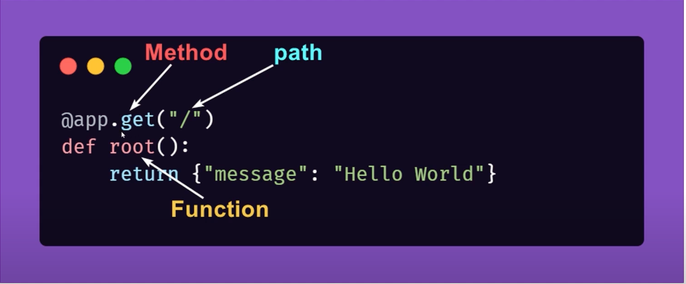

# Python API Development

- Will be using this repo for learning API development using Python.

### Tech Stack

- **Fast API**: Cause it's build keeping api development in mind and also has a auto documentation feature (becasue it is important to document how an api works)
- **Postgres**: SQL database (almost all the same)
- **SQL Alchemy**: ORM, most standard one for python frameworks, most popular

---

## Documentations:

- Please visit the [FastAPI Documentations](https://fastapi.tiangolo.com/tutorial/first-steps/#what-is-openapi-for) Page.
- It literally has everything, from setting up venvs to everything to write robost APIs in pyhton

---

### Backend API Dev

- Backend api dev, is just making a bunch of path operations
  

---

## Things Learned

1. Central Env variable loading
   - done using config file using pydantic-settings package:BaseSettings
   - Introduces:
     - Type safety
     - Env variable validation
     - Centralized config loading. Single source of truth
     - Gives Auto complete and IDE help (from pydantic-settings package)
   - Now instead of loading env variables in each file, we just import the settings/config class from the app.config and use the follow way to access env variables

```python
from app.config import settings

env_variable = settings.ENV_NAME
```

---

### Important Commands

1. Starting the API server

```
uvicorn app.main:app --reload
```

2.
